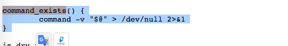
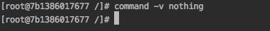

# (작성중)
### TL;DR
평소에 인용해 사용하던 [get-docker.sh](https://get.docker.com/) 내부의 command_exists 함수의 동작을 파헤쳐보았다. 


### 들어가며
[get-docker.sh](https://get.docker.com/) 는 [get-pip.py](https://bootstrap.pypa.io/get-pip.py) 처럼 널리 사용되는 설치 스크립트이다.
어느 os, 어느 cpu architecture에서도 잘 돌아가는 설치스크립트는 꽤나 잘만들어져있다는 느낌을 준다.
<br/>

get-docker.sh 코드 내부에 있는 command_exists 함수는 쉘스크립트가 보통은 갖기힘든 아름다운 가독성을 보여준다.
사용예는 이렇다. `if command_exists sudo; then` <br/>

이번 글에서는 이 command_exists 함수 내부의 내용을 파헤쳐보겠다. 


### command_exists 함수
브라우저로 https://get.docker.com/ 에 접속해보자.<br/>
shebang line `#!/bin/sh` 로 시작하는 쉘 스크립트의 내용을 볼 수 있는데, 이것은 그 유명한 `docker`를 설치해주는 스크립트이다.
<br/>

내용 중 아래로 내려가다보면 `command_exists` 라는 함수가 보일것이다. 3줄짜리 간단한 코드이고, 오늘 파헤쳐볼 코드이다.<br/>



### command -v
`command -v "$@"` 부터 알아보자.<br/> 
아래는 command manual 중 `-v` 옵션의 내용이다. 
<br/><br/>

`-v` 뒤의 내용을 `re-read` 되는 내용으로 변경해준다. python 으로 예를들면 이런식이다.<br/>
```
$ command -v python
> /usr/bin/python
```

뒤의 내용이 실제로 실행할 파일이 있을때 결과가 출력된다.<br/>
없을때에는? 아무것도 출력되지않는다.
<br/><br/>

즉 command 가 존재하는지 여부를 판단할때 아래와 같은 쉘 조건문을 많이 사용한다.
```
if [ "$(command -v nothing)" == "" ]; then
    # early exit
    echo "Install nothing first"
    exit 1;
fi

# do something 
```


### "@#"
그렇다면 `command -v` 뒤의 "@#"는 무슨내용일까?
(내일작성하자~~)

ref: 널장치 wikipedia https://ko.wikipedia.org/wiki/%EB%84%90_%EC%9E%A5%EC%B9%98
프로그래머들 사이에서 (특히 유닉스 쪽) 널 장치는 비트 버킷[2] 또는 블랙홀로 불린다

https://stackoverflow.com/questions/818255/in-the-shell-what-does-21-mean
2>&1 2>1 은 같은의미다 를 설명해줌. 명시적으로 의미를 보여주는것

https://unix.stackexchange.com/questions/23964/why-is-redirecting-stderr-to-dev-null-done-this-way
2>&1, 1> /dev/null 의 의미

ref: redirection cheetsheet https://gist.github.com/gin1314/3697341

```bash
ls file_that_doesnt_exist 1> /dev/null
ls: cannot access file_that_doesnt_exist: No such file or directory

ls file_that_doesnt_exist 2> /dev/null
""
```

```bash
$ touch file_that_exists
$ ls file_that_exists 1> /dev/null
> ""

$ ls file_that_exists 2> /dev/null
> file_that_exists
```
-> /dev/null 은 출력을 버리는것.
-> 출력이 비슷하게 보였지만 stdout, stderr로 나뉘어져있었음.

```bash
$ if ls file_that_doesnt_exist; then     echo true; else    echo false; fi
> ls: cannot access file_that_doesnt_exist: No such file or directory
> false

$ if ls file_that_exists; then     echo true; else    echo false; fi
> file_that_exists
> true
```
- function 넣고하면 무엇이 다른가?
```bash
$ file_exists() {
    ls "$@"
}

$ touch file_that_exists
$ file_exists file_that_exists
> file_that_exists
$ file_exists file_that_doesnt_exist
> ls: cannot access file_that_doesnt_exist: No such file or directory
```
- function 없이.
```bash
$ touch file_that_exists
$ ls file_that_exists
> file_that_exists
$ ls file_that_doesnt_exist
> ls: cannot access file_that_doesnt_exist: No such file or directory
```
-> function 으로 감싸도 결과는 같다.

- `> /dev/null` 로 stdout 출력을버리고
```bash
$ touch file_that_exists
$ ls file_that_exists  > /dev/null
> ""
$ ls file_that_doesnt_exist  > /dev/null
> ls: cannot access file_that_doesnt_exist: No such file or directory
```

- `2>&1` 로 stderr를 stdout으로 바꾼다.
```bash
$ touch file_that_exists
$ ls file_that_exists  > /dev/null 2>&1
> 
$ ls file_that_doesnt_exist  > /dev/null 2>&1
> 
```
-> 아 여기서 stderr도 stdout으로 가고, stdout는 버려지므로 stderr도 버려진다.
-> 결과만 남고 출력을 안하겠다는 의도같다.
- 확인 1. redirection 있을때.
```bash
$ file_exists() {
    ls "$@"
}

$ touch file_that_exists
$ if file_exists file_that_exists; then     echo true; else    echo false; fi
> file_that_exists
> true

$ if file_exists file_that_doesnt_exist; then     echo true; else    echo false; fi
> ls: cannot access file_that_doesnt_exist: No such file or directory
> false
```
- 확인 2. /dev/null redirection 만 있을때.
```bash
$ file_exists() {
    ls "$@" > /dev/null
}

$ touch file_that_exists
$ if file_exists file_that_exists; then     echo true; else    echo false; fi
> true

$ if file_exists file_that_doesnt_exist; then     echo true; else    echo false; fi
> ls: cannot access file_that_doesnt_exist: No such file or directory
> false
```
- 확인 3. /dev/null, 2>&1 redirections 있을때.
```bash
$ file_exists() {
    ls "$@" > /dev/null 2>&1
}

$ touch file_that_exists
$ if file_exists file_that_exists; then     echo true; else    echo false; fi
> true

$ if file_exists file_that_doesnt_exist; then     echo true; else    echo false; fi
> false
```
-> 확인결과 예상이 맞다.
- 그렇다면 2> /dev/null 을 추가하면 같은결과가 나올것같다.
```bash
$ file_exists() {
    ls "$@" > /dev/null 2> dev/null
}

$ touch file_that_exists
$ if file_exists file_that_exists; then     echo true; else    echo false; fi
> true

$ if file_exists file_that_doesnt_exist; then     echo true; else    echo false; fi
> false
```
-> 이렇게 사용하는것이 가독성이 더 높을것같다. 2>&1는 좀더 의도가 숨겨져있는 느낌이다. 

#### 참고
- 중간에 띄어쓰기 때문에 작동안한 시행착오가있었다. 1, 2뒤에는 공백이 들어가면 안되는듯하다.
- `ls "$@" > /dev/null 2> dev/null` (작동함)
- `ls "$@" > /dev/null 2 > dev/null` (작동안함)
