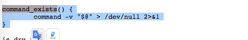
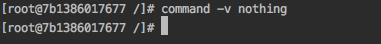
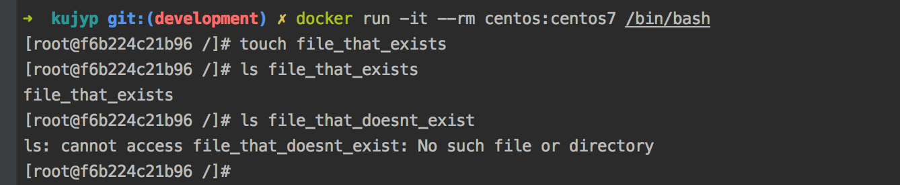
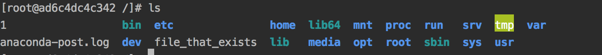

### TL;DR
평소에 인용해 사용하던 [get-docker.sh](https://get.docker.com/) 내부의 command_exists 함수의 동작을 파헤쳐보았다. 


### 들어가며
[get-docker.sh](https://get.docker.com/) 는 [get-pip.py](https://bootstrap.pypa.io/get-pip.py) 처럼 널리 사용되는 설치 스크립트이다.
어느 os, 어느 cpu architecture에서도 잘 돌아가는 설치스크립트는 꽤나 잘만들어져있다는 느낌을 준다.
<br/>

get-docker.sh 코드 내부에 있는 `command_exists` 함수는 쉘스크립트가 보통은 갖기힘든 아름다운 가독성을 보여준다.
사용예는 이렇다.<br/>
```bash
if command_exists sudo; then
    echo command sudo exists
fi

if ! command_exists sudo; then
    echo command sudo not exists
fi
```

이번 글에서는 이 `command_exists` 함수 내부의 내용을 파헤쳐보겠다. 


### command_exists 함수
브라우저로 https://get.docker.com/ 에 접속해보자.<br/>
shebang line `#!/bin/sh` 로 시작하는 쉘 스크립트의 내용을 볼 수 있는데, 이것이 `get-docker.sh`의 코드 내용이다.
<br/>

내용 중 아래로 내려가다보면 `command_exists` 라는 함수가 보일것이다. 3줄짜리 간단한 코드이고, 오늘 파헤쳐볼 코드이다.<br/>



### command -v
`command -v "$@"` 부터 알아보자.<br/> 
아래는 command manual 중 `-v` 옵션의 내용이다. 
<br/><br/>

`-v` 뒤의 내용을 `re-read` 되는 내용으로 변경해준다. python 으로 예를들면 이런식이다.<br/>
```
$ command -v python
> /usr/bin/python
```

뒤의 내용이 실제로 실행할 파일이 있을때 결과가 출력된다.<br/>
없을때에는? 아무것도 출력되지않는다.
<br/><br/>

즉 command 가 존재하는지 여부를 판단할때 아래와 같은 쉘 조건문을 많이 사용한다.
```
if [ "$(command -v nothing)" == "" ]; then
    # early exit
    echo "Install nothing first"
    exit 1;
fi

# do something 
```


### "@#"
그렇다면 `command -v` 뒤의 "$@"는 무슨내용일까?<br/>

함수 또는 스크립트에 들어온 모든 parameter를 의미한다.<br/>

아래의 예시에서 helloworld function에 들어온 $@는 각각 "", "a", "a b" 이다.<br/>
참고: macos와 linux의 shell 동작이 다를 수 있어서 예시는 docker centos7 image에서 실행했다.   
```
docker run -it --rm centos:centos7 /bin/bash

function helloworld() {
    echo "helloworld $@"
}

### MAIN ###
helloworld
helloworld a
helloworld a b

> helloworld
> helloworld a
> helloworld a b
```
- ref: [What does $@ mean in a shell script?](https://stackoverflow.com/a/9994328)


### /dev/null(널장치)
`command -v "$@" > /dev/null 2>&1`

먼저 `/dev/null` 앞의 `>`는 표준입력(stdout)을 redirection 한다는 것을 의미한다.<br/>
표준입력을 `/dev/null` 로 redirection 한다는 의미인데, 여기에서 `/dev/null` 로 보낸다는의미는 버린다는 의미와 같다.<br/>
즉 stdout으로 출력될 문구를 출력하지 말라는 의미이다.

[wikipedia 널 장치](https://ko.wikipedia.org/wiki/%EB%84%90_%EC%9E%A5%EC%B9%98)에 따르면 유닉스 쪽에서 `/dev/null` 은 비트 버킷 또는 블랙홀로 불린다고한다.

- ref: wikipedia 널 장치 https://ko.wikipedia.org/wiki/%EB%84%90_%EC%9E%A5%EC%B9%98


### file descriptor 1, 2
`command -v "$@" > /dev/null 2>&1`

`/dev/null` 바로 뒤 `2` 에 주목하자 이는 file descriptor를 의미한다.<br/>
여기서 `file descriptor 1` 은 `stdout`, `file descriptor 2` 는 `stderr` 를 의미한다.<br/>
아래의 예시를 보자.

```bash
docker run -it --rm centos:centos7 /bin/bash

touch file_that_exists
# stdout을 버린다.
ls file_that_exists 1> /dev/null
> ""
ls file_that_doesnt_exist 1> /dev/null
> ls: cannot access file_that_doesnt_exist: No such file or directory

# stderr를 버린다.
ls file_that_exists 2> /dev/null
> file_that_exists
ls file_that_doesnt_exist 2> /dev/null
""
```

-> ls 명령어의 출력이 비슷해보이지만 `stdout`, `stderr`가 나뉘어져있었다.


- ref: [In the shell, what does “ 2>&1 ” mean?](https://stackoverflow.com/a/818284)

### 2>&1
`command -v "$@" > /dev/null 2>&1`

다음은 `2>&1` 차례이다.<br/>
`&` 기호는 뒤의 내용이 `file descriptor` 라는 것을 보여준다.<br/>
즉 `&1` 은 `stdout` 을 의미한다.<br/>
(&가 없으면 `1` 을 파일이름으로 하는 파일에 해당 내용이 redirection 된다.)

즉 이 코드는 앞에서 `/dev/null` 로 보냈던 `stdout`에 `stderr`를 연결해서 `stderr`까지 둘다 버리는것을 의미한다.

아래의 예시를 실행해보면 더 명확하게 알수있다.
```bash
docker run -it --rm centos:centos7 /bin/bash
 
touch file_that_exists

# stderr는 버려지지않는다.
ls file_that_doesnt_exist > /dev/null
> ls: cannot access file_that_doesnt_exist: No such file or directory
# stderr도 버려서 아무것도 출력되지않는다. 
ls file_that_doesnt_exist > /dev/null 2>&1
>

# stderr를 파일 "1"에 redirection, 아무것도 출력은 안된다.
ls file_that_doesnt_exist > /dev/null 2>1
>
# cat으로 file "1"을 출력해보면 내용이 남아있다. 
cat 1
> ls: cannot access file_that_doesnt_exist: No such file or directory
``` 
- 참고: `2>1`을 하는 상황에서 `ls` 를 입력해보면, `1` 이라는 파일이 생성된것을 볼 수 있다.


- ref: [In the shell, what does “ 2>&1 ” mean?](https://stackoverflow.com/a/818284)
- ref2: [Why is redirecting STDERR to /dev/null done this way?](https://unix.stackexchange.com/a/23966)
- ref3: [gist - bash: redirection cheetsheet](https://gist.github.com/gin1314/3697341)


### shell if
위에서 설명한 function은 실제로 if 문 내부에서 써먹는다.<br/>
if 문 내부에서 shell statement가 성공, 실패했을때 동작을 살펴보자.

```bash
docker run -it --rm centos:centos7 /bin/bash
 
touch file_that_exists

# shell statement 성공시
if ls file_that_exists
then
    echo true
else
    echo false
fi
> file_that_exists
> true

# shell statement 실패시
if ls file_that_doesnt_exist
then
    echo true
else
    echo false
fi
> ls: cannot access file_that_doesnt_exist: No such file or directory
> false
```
-> if 뒤에 나오는 statement가 성공시 true, 실패시 false를 반환하는것을 알 수 있다.

- 참고: function에 해당 구문을 넣어보았다.

```bash
docker run -it --rm centos:centos7 /bin/bash

function file_exists() {
    ls "$@"
}

touch file_that_exists
if file_exists file_that_exists
then
    echo true
else
    echo false
fi
> file_that_exists
> true

if file_exists file_that_doesnt_exist
then
    echo true
else
    echo false
fi
> ls: cannot access file_that_doesnt_exist: No such file or directory
> false
```
-> function 으로 감싸도 결과는 같다.

### 결론
위에서 알아낸 내용을 종합하면 이 `command_exists` 함수는 
1. `command -v "인자"` 의 성공/실패여부를 반환하고,
2. `stdout`, `stderr`로 나와야할 출력을 `/dev/null` 로 버려주는 역할을 수행한다.
<br/>

```bash
command_exists() {
    command -v "$@" > /dev/null 2>&1
}
```

이 함수를 통해 아래와 같이 사용해왔던 if 문을 좀더 미려하게 사용할 수 있게 만들었다.   
```bash
# before
if [ "$(command -v somethingtocheck)" == "" ]; then
    echo command not exists!
fi

# after
if ! command_exists somethingtocheck; then
    echo command not exists!
fi
```

### 마치며
shell script는 정식으로 배울일이 없어서 예전부터 구글링하면서 작성을 해왔다.<br/>
눈앞의 문제를 해결하기위해서만 코드 작성을 하다보면, 궁금한점이 자꾸 쌓이는데, 이번 기회에 여러가지 실험해보면서 정리를 해볼 수 있었다.<br/>

꽤 개운한 경험인것 같다.


### 참고
- 참고1. 위에서 사용한 스크립트를 좀더 개선해보았다.<br/>
가독성 측면에서 기존의 `2>&1` 는 좀 더 의도가 숨겨져있는 느낌이다.

```bash
docker run -it --rm centos:centos7 /bin/bash

function file_exists() {
    ls "$@" 1> /dev/null 2> dev/null
}

touch file_that_exists
if file_exists file_that_exists; then     echo true; else    echo false; fi
> true

if file_exists file_that_doesnt_exist; then     echo true; else    echo false; fi
> false
``` 

- 참고2. 중간에 띄어쓰기 때문에 작동안한 시행착오가있었다. 1, 2뒤에는 공백이 들어가면 안되는듯하다.
  - `ls "$@" > /dev/null 2> dev/null` (작동함)
  - `ls "$@" > /dev/null 2 > dev/null` (작동안함)\

- 참고3. shell은 공식 document를 어디서 찾아야하는지 몰라서 reference를 stackoverflow에서 가져왔다.
- 참고4. shebang line을 보니 get-docker.sh 는 `sh`를 사용한다. shell script를 작성하다보면 가끔 `bash`와 `sh`의 차이에서 가끔 막히는경우가 있는데, 이번 글에서는 겪지 못한것을 보니 이번 글에서 사용한 기법들은 차이가 없나보다. 
