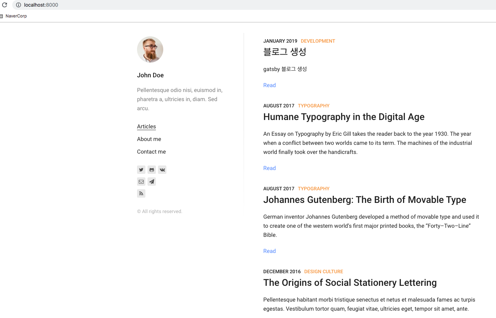

# gatsby 블로그 생성

ref: https://www.gatsbyjs.org/docs/quick-start

### Quick start 
```bash
mkdir blog && cd blog
yarn global add gatsby-cli
gatsby new kujyp https://github.com/alxshelepenok/gatsby-starter-lumen

cd kujyp
webstorm .
gatsby develop
```
- http://localhost:8000 접속하면 

