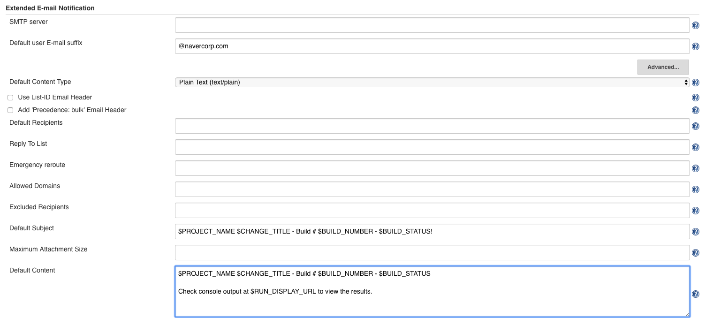
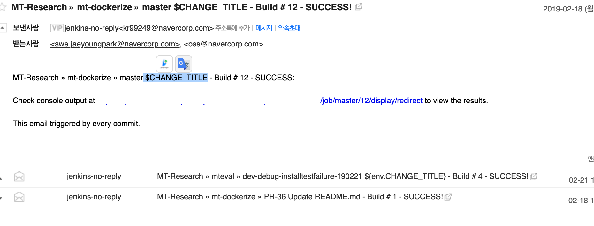
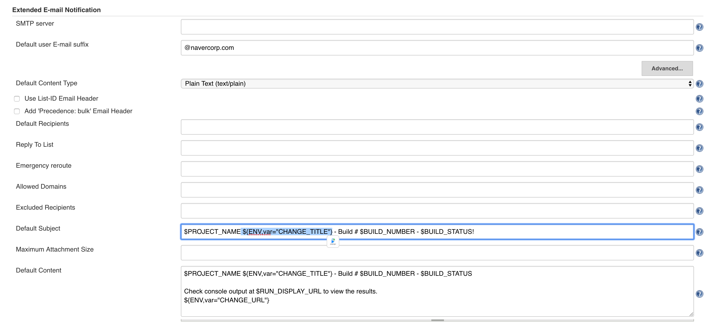
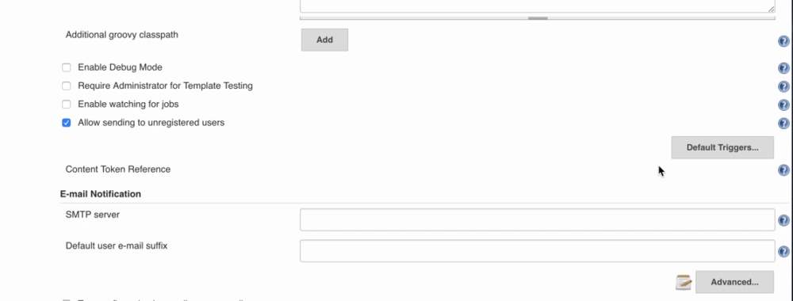
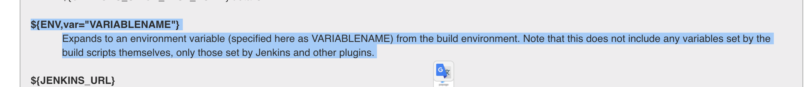

### TL;DR
Jenkins Extended E-mail Notification plugin을 사용하여 email 알림을 보낼때 비어있는 환경변수를 처리한다. 


#### Email-ext plugin
[Email-ext plugin](https://wiki.jenkins.io/display/JENKINS/Email-ext+plugin) 은 Jenkins에서 작업 완료 알림을 이메일로 받아 볼 수 있도록 해준다.

나는 사내 Repository에서 Jenkins pipeline 중 post block을 아래의 내용으로 채우고있다.<br/>
tag나 Pull Request로 유발된 작업이거나, master branch 인 경우, 작업이 끝났을때 알림 이메일을 보낸다는 내용이다.<br/> 
```groovy
post {
    always {
        // recipientProviders document: https://jenkins.io/doc/pipeline/steps/email-ext/
        script {
            if (env.BRANCH_NAME == "master"
                    || env.BRANCH_NAME.startsWith("PR")
                    || env.TAG_NAME) {
                def committerEmail = sh (
                    script: 'git --no-pager show -s --format=\'%ae\'',
                    returnStdout: true
                ).trim()

                emailext(
                  subject: '$DEFAULT_SUBJECT',
                  body: '$DEFAULT_CONTENT\n\
\n\
This email triggered by (PR, tag, master branch) only.\n\
',
                  to: committerEmail,
                  recipientProviders: [
                    [$class: 'DevelopersRecipientProvider'],
                    [$class: 'RequesterRecipientProvider'],
                    [$class: 'CulpritsRecipientProvider']
                  ],
                )
            }
        }

        deleteDir()
        echo 'done'
    }
...
}
```

Email-ext plugin을 사용하면, `Default Subject`(제목)이 `$PROJECT_NAME - Build # $BUILD_NUMBER - $BUILD_STATUS!` 로 세팅되어있다.<br/>
`Manage Jenkins > Configure System > Extended E-mail Notification > Defalt Subject, Default Content` 에서 변경이 가능한데,<br/>
Pull Request를 하는경우 어떤 PR에서 날라온 결과인지 구분하기위해 제목에 PR이름을 추가했다.<br/>
Jenkins에서는 이를 `$CHANGE_TITLE` 로 제공한다.<br/>
```bash
$PROJECT_NAME $CHANGE_TITLE - Build # $BUILD_NUMBER - $BUILD_STATUS!
```


그런데 이것이 일반 브랜치(master, tag로 trigger되는경우)에서는 PR제목이 존재하지않아서, `$CHANGE_TITLE` 에 넣을 값이 존재하지 않는 경우가 생긴다.<br/>
이 경우 Email-ext plugin은 이메일에 `$CHANGE_TITLE` 문자를 그대로 발송한다.<br/>


이를 개선하려고 찾아보니 환경변수를 `${ENV, var="VARIABLE_NAME"}`로 가져올수 있어서, 이 포맷를 적용했다.<br/>
Shell 환경변수는 가져올때 해당변수가 할당이 안되어있는경우 공백("")을 제공하므로 위의 문제를 해결할 수 있다.<br/>   


- 아래는 참고했었던, 문서 위치.<br/>
`Manage Jenkins > Configure System > Extended E-mail Notification` 섹션에서, `Content Reference` 오른쪽의 물음표(?)를 클릭하면 볼수있다.  

- ${ENV, var="VARIABLENAME"}

