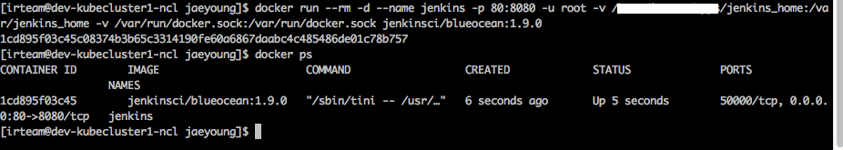
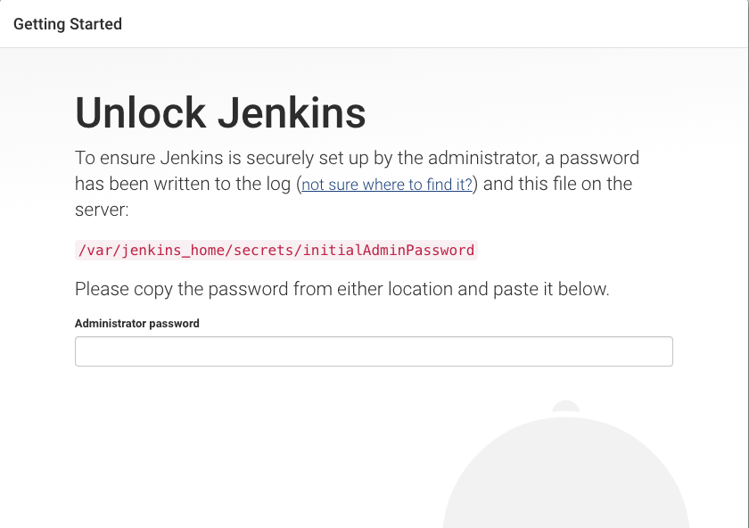
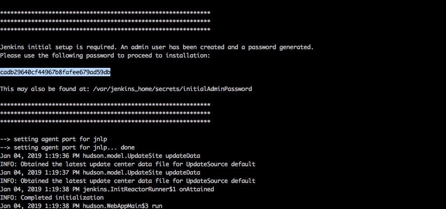
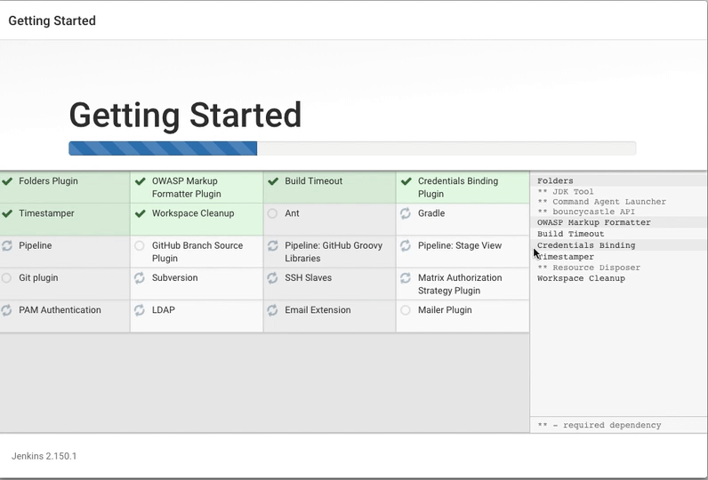
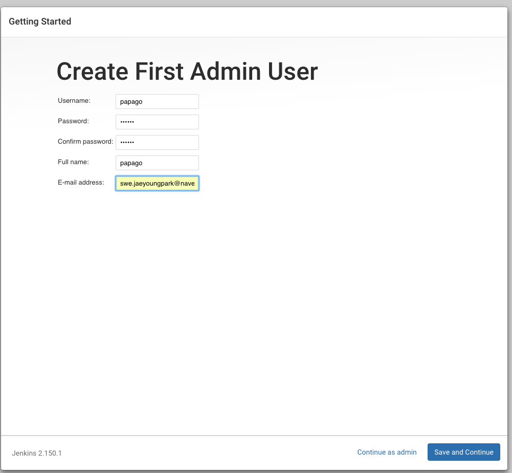
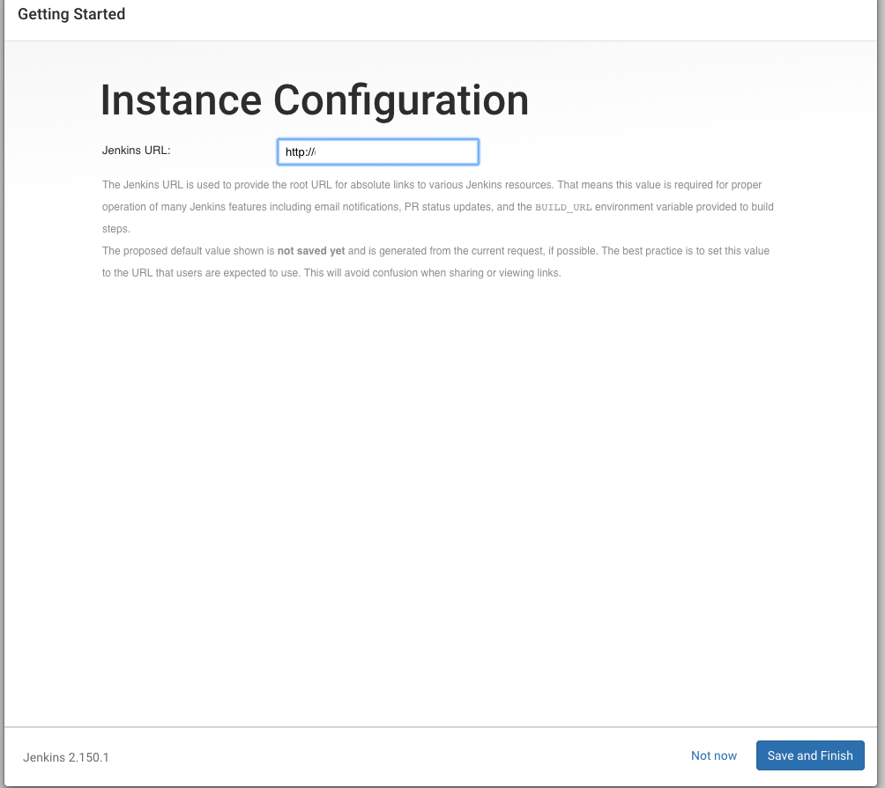
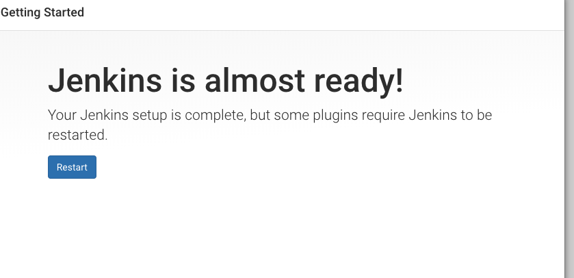
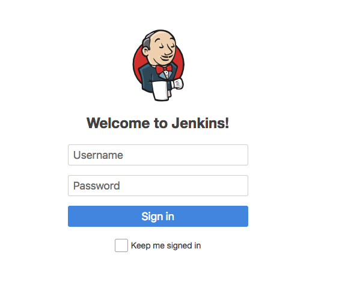
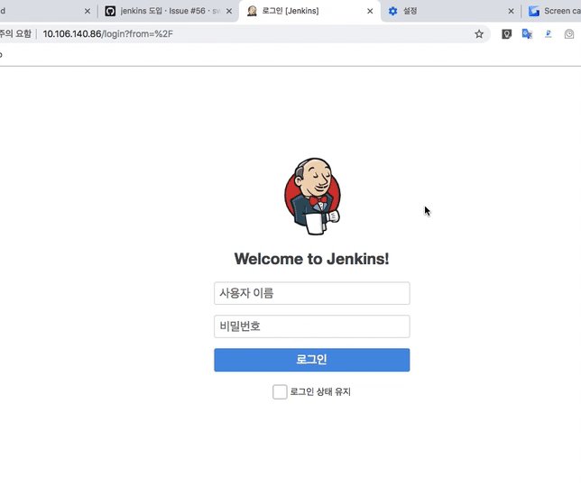
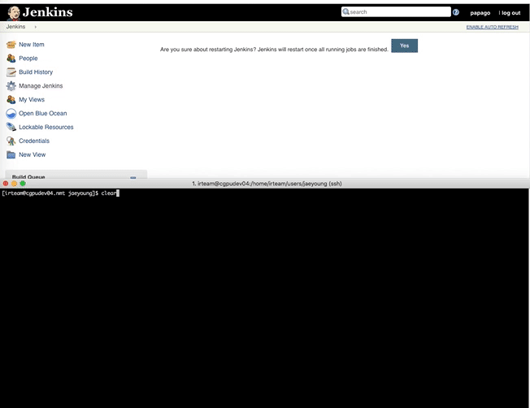

### 개요
아래 스펙의 jenkins를 설치하는것을 목적으로 합니다.
- jenkins(host container)를 docker image를 사용하여 구동합니다.
- jenkins login을 github auth와 연동합니다.
- UI로 blueocean을 사용합니다.
- Jenkins job item 으로 pipeline job(organization, multi branch) 을 사용합니다.
- Groovy 언어로 작성된 Jenkinsfile 을 사용합니다.
- 메일발송으로 emailext plugin를 사용합니다.
- jenkins job을 docker agent를 사용하여 구동합니다.(위의 host container와 구분되는 runner container 입니다)

## 목차
- [**1. Install Jenkins**](/posts/2019-04-14---Jenkins-pipeline-tutorials---1--Install-Jenkins/)
  - 1-1. docker 설치
  - 1-2. jenkins container 실행
  - 1-3. jenkins web 접속
- [2. Install github authentication plugin](/posts/2019-04-25---Jenkins-pipeline-tutorials---2--Install-github-authentication-plugin/)
  - 2-1. plugin 설치
  - 2-2. plugin 설정
- [3. Webhook settings](/posts/2019-05-01---Jenkins-pipeline-tutorials---3--Webhook-settings/)
- [4. Jenkins Job 생성하기](/posts/2019-05-06---Jenkins-pipeline-tutorials---4--Jenkins-Job-생성하기/)
  - 4-1. Pipeline Organization job 생성하기
  - 4-2. tag automatic trigger 문제
  - 4-3. tag automatic trigger 문제해결
- (미작성)
  - 5. jenkins concurrency
<br/>

## 과정
### 1. Install jenkins
#### 1-1. docker 설치
가이드는 Centos를 기준으로 작성합니다. Ubuntu나 기타 OS 사용자는 Reference 링크 참조하면 될 것 같습니다.

제 경우 GPU 가 필요한 job을 돌려야하기 때문에, nvidia-docker 까지 설치합니다.

```bash
yellow="\033[0;33m"
red="\033[0;31m"
nocolor="\033[0m"

function command_exists() {
    command -v "$@" 1> /dev/null 2>&1
}

function check_gpu_exists() {
    nvidia-smi 1> /dev/null 2>&1
}


### Main
if [[ "$(id -u)" -ne "0" ]]; then
    echo -e "${red}[ERROR] install with root privilege.${nocolor}"
    exit 1
fi

# Remove legacy docker
yum remove docker \
    docker-client \
    docker-client-latest \
    docker-common \
    docker-latest \
    docker-latest-logrotate \
    docker-logrotate \
    docker-engine

# Remove pre-installed docker, nvidia-docker
yum remove docker -y \
    docker-engine \
    containerd.io \
    docker-ce-cli \
    nvidia-container-runtime

# Install dependencies
yum install -y yum-utils \
    device-mapper-persistent-data \
    lvm2

yum-config-manager \
    --add-repo \
    https://download.docker.com/linux/centos/docker-ce.repo


if check_gpu_exists; then
    distribution=$(. /etc/os-release;echo $ID$VERSION_ID)
    curl -s -L https://nvidia.github.io/nvidia-docker/$distribution/nvidia-docker.repo | \
        tee /etc/yum.repos.d/nvidia-docker.repo

    yum install -y nvidia-docker2
    sed -i '2i \    \"default-runtime\": \"nvidia\",' /etc/docker/daemon.json
else
    yum install -y docker-ce
fi

# Replace <LINUX_USERNAME> with your username.
usermod -aG docker <LINUX_USERNAME>

# Start docker service on startup
systemctl enable docker.service

systemctl start docker
```
<br/>

- Ref: https://docs.docker.com/install/linux/docker-ce/centos/
- Ref: https://docs.docker.com/install/linux/docker-ce/ubuntu/
<br/><br/>


### 1-2. jenkins container 실행
- jenkins를 docker container로 구동합니다.
- Jenkins image는 `jenkinsci/blueocean:1.9.0` 를 사용합니다.<br/>
사용가능한 tag list는 아래링크에서 확인가능합니다.<br/>
https://hub.docker.com/r/jenkins/jenkins/tags (official jenkins)<br/>
https://hub.docker.com/r/jenkinsci/blueocean/tags (official jenkins/blueocean)
- 아래의 `<JENKINS_HOME>` 부분을 본인이 jenkins home으로 사용하고싶은 경로로 지정합니다.<br/>
jenkins 는 jenkins home 경로에 Configurations, Installed Jenkins plugins, <br/>
Job 도중 생성되는 files(cloned source codes, build artifacts)를 저장합니다.
- 즉 Jenkins docker container 를 삭제, 재생성할때, 위의 경로에 이전에 사용하던 파일이 존재하면, 그 상태 그대로 복구가능합니다.
```
docker run -d --restart=always \
        --name jenkins \
        -p 80:8080 \
        -u root \
        -v <JENKINS_HOME>:/var/jenkins_home \
        -v /var/run/docker.sock:/var/run/docker.sock \
        jenkinsci/blueocean:1.9.0
```
<br/>

- 실행후 `docker ps` 로 실행여부 확인해줍니다.<br/>
<br/><br/>
- 참고: 이때 docker run 옵션에서 `-v /var/run/docker.sock:/var/run/docker.sock` 는 jenkins 내부에서 docker agent를 돌려야하는데, jenkins 이미지는 [docker in docker](https://github.com/jpetazzo/dind)가 구현되어있지않아서 내부에 docker container를 생성할수없습니다.<br/>
따라서 외부의 docker를 사용하기위해 docker.sock을 공유해줍니다.
- ref: https://jenkins.io/doc/tutorials/build-a-python-app-with-pyinstaller/#run-jenkins-in-docker <br/><br/>


#### 1-3. jenkins web 접속
- 2번과정에서 80포트로 개방한 jenkins web으로 접속합니다.
- Jenkins container 를 띄운 곳의 Web domain or ip 를 브라우저에 입력하여 접속합니다.
- 최초 Unlock 진행해야합니다. `docker logs jenkins` 로 로그로 찍혀있는 password 복사, 입력합니다.<br/>
<br/><br/>
<br/><br/>
- 이어서 나오는메뉴에서 Install suggested 입력합니다.<br/>
<br/><br/>
- admin 계정생성하라고 나오는데, 대충 만들어줍니다. github auth 사용하면 이 계정으로 로그인 불가합니다.<br/>
<br/><br/>
- jenkins URL 입력해줍니다.
- domain 을 사용할 계획이라면, 여기에서 ip address 를 domain 으로 바꿔야합니다.<br/>
제 경우 여기에서 넘어갔다가, 나중에 새로 할당받은 도메인으로 변경하려고 하니 proxy 설정에러가 발생해 재설치가 필요했습니다.<br/>
<br/><br/>
- restart 해줍니다.<br/>
<br/><br/>
- restart 하니 제 경우 계속 저 progress창에서 멈춰있었습니다.
- 새로고침하면 다시 뜹니다.<br/>
<br/><br/>
- 로그인창이 나타납니다.<br/>

<br/><br/>

#### 참고1. jenkins web 언어 한글로 나올때.
- 언어가 한글로 나오는경우 메뉴이름이 달라져서 구글링도 힘들어지고 여러모로 불편합니다.
- 브라우저 주 언어설정을 English로 변경합니다.
- chrome의경우 settings(cmd+,) - advance - language - english(미국)을 맨 위로 올려주면 됩니다.<br/>

<br/><br/>

#### 참고2. jenkins log
- jenkins log를 보면서 과정을 진행하면 문제가 생겼을때 상황을 알기 더 용이합니다.
- `docker logs -f jenkins`로 로그를 무중단으로 볼수있습니다.<br/>

<br/><br/>
