### TL;DR
React를 사용하는 정적 페이지 생성 툴 [gatsby](https://www.gatsbyjs.org/)를 활용해 개발블로그를 만들어 보았다.
[lumen starter](https://github.com/alxshelepenok/gatsby-starter-lumen)를 활용해 css, plugin가 미리 세팅된 환경에서 작업을 시작했고,
 github pages를 이용해 생성된 정적페이지를 호스팅했다.


### 들어가며
2019년을 맞이해서 2018년 회고도 할겸, 미루기만 해왔던 개발블로그를 제작을 해보았다.
개발을 쭉 해오면서 정리해놓은 자료들이 아깝기도하고, 이대로 고생했던 경험을 잊어버릴까봐 걱정되는 마음이 있어서 언젠가는 개발블로그를 만들어보자는 생각을 갖고있었다.
그 과정에서 겪은 내용들을 개발블로그 첫 포스팅으로 올려본다.

### 블로그 서비스 선택
제일 먼저 고려했던것은 `직접 개발하기` 였다.
욕심이 많아서 중간중간에 블로그에 넣고싶은 기능들이 계속 생겨날텐데, 그것을 감당하려면 아무래도 직접개발이 가장 좋지 않나 생각했다.

하지만 올해 6월 해커톤에서 만들었던 [tilup](https://github.com/OrangeTen/TodayILearned) 서비스를 유지하는 과정에서, 직접 호스팅하는 작업이 생각보다 손이 많이간다는것을 느꼈다.
호스팅에서 꾸준하게 생기는 이슈(dockerize한 이미지를 dockerhub에 배포 했더니 AWS traffic으로 과금이 일어나지를 않나, VM의 용량이 부족해서 주기적으로 docker image prune을 해줘야하질 않나)를 본업이 있는 와중에 해결하다보니,
 간단한 이슈임에도 꽤 오랜기간이 서비스가 중단된채로 방치되고, 이런 이슈가 반복되다보니 서서히 끈기를 잃어가는것을 느꼈다. 

그래서 이번 블로그에서 가장 중점적으로 본것은 `유지보수가 편한것`이다. 유지보수가 편하려면,
1. 호스팅을 직접하지 않는 서비스
1. 유명한 서비스
1. 평소 사용하던 언어 등을 사용하는 서비스여야했다.

이 조건을 모두 만족하는 서비스를 찾다보니, [github pages](https://pages.github.com/)+[gatsby](https://www.gatsbyjs.org/)를 찾게되었다.
호스팅을 [github pages](https://pages.github.com/)로 대신해주고, 유명하고(github star 3만개), 평소사용하던 markdown, nodejs/React 를 사용하는 서비스였다.
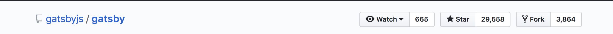

[github pages](https://pages.github.com/)+[jekyll](https://jekyllrb.com/), [medium](https://medium.com), [가입형 wordpress](https://wordpress.com/) 들도 고려해보았지만,
 React의 생태계를 모두 사용할 수 있다는 말에 넘어가서 gatsby를 사용하기로 결정했다.  


### 설치 과정
- 이 가이드는 [gatsby-starter-lumen](https://github.com/alxshelepenok/gatsby-starter-lumen)을 사용한다.
- gatsby-cli 설치, starter를 이용해 블로그 프로젝트 생성(yarn 대신 npm을 사용해도 무관.)
```bash
mkdir blog && cd blog
yarn global add gatsby-cli
gatsby new kujyp https://github.com/alxshelepenok/gatsby-starter-lumen
cd kujyp
```
- github pages 세팅
  - username.github.io repo를 생성(https://github.com/kujyp/kujyp.github.io)
  - development branch에 stareter code를 push.(master는 build 결과물을 올려야한다.)
```bash
git init
git checkout -b development
git add .
git commit -m "init with starter"
git remote add origin https://github.com/kujyp/kujyp.github.io.git
git push -u origin development
```
- starter config 변경
  - gatsby-config.js 에서 siteMetadata 를 수정한다.
  - disqusShortname 은 아래의 가이드대로 추가한다.
  - contact page 는 삭제했다.
- github pages 배포
  - package.json 에서 deploy 명령어를 변경한다.<br/>
`gh-pages -d public -b master`
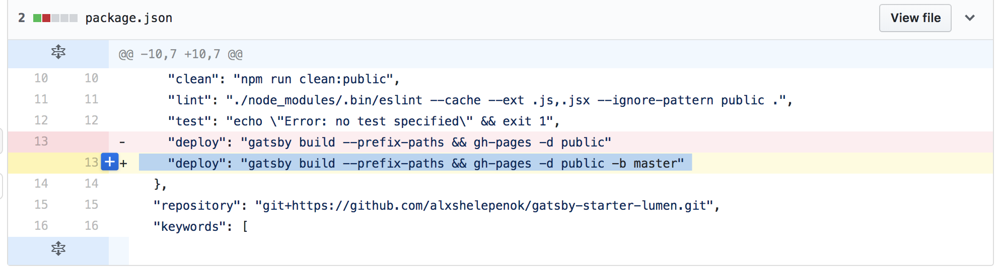
  - deploy를 실행한다. 30초정도 소요된다.
```bash
yarn run deploy
```
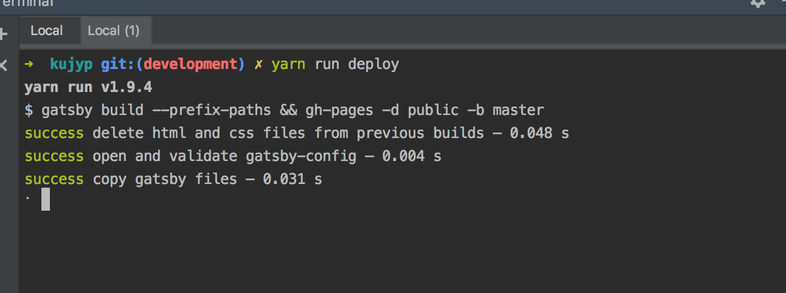
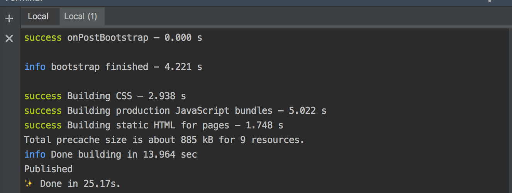

- 개발모드(hot reloading 기능이 지원되서 파일을 수정하면 localhost 페이지에 바로 반영된다.)
```bash
gatsby develop
```
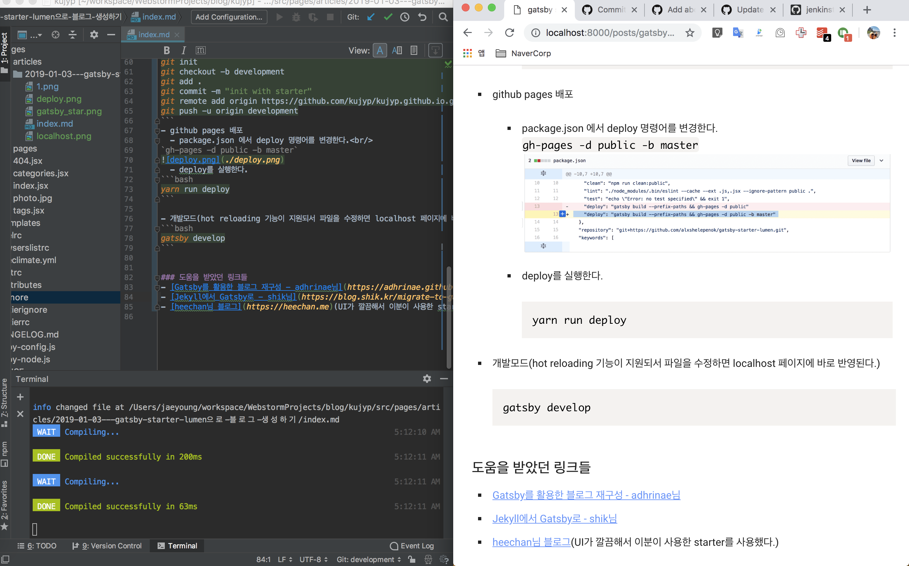


### disqus 추가하기
- https://disqus.com 에 접속해서 사이트를 추가한다. disqusShortname 을 받아와야한다.
- get started 클릭
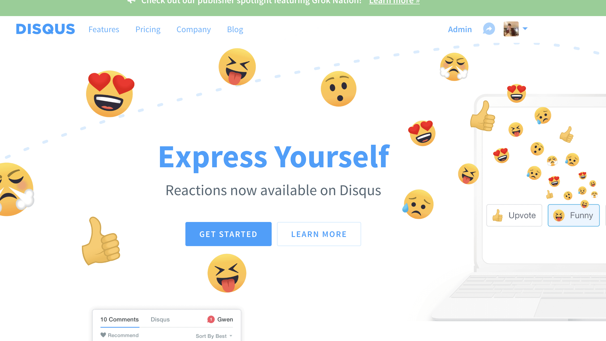
- I want to install Disqus on my site 클릭

- website name 입력, category 선택
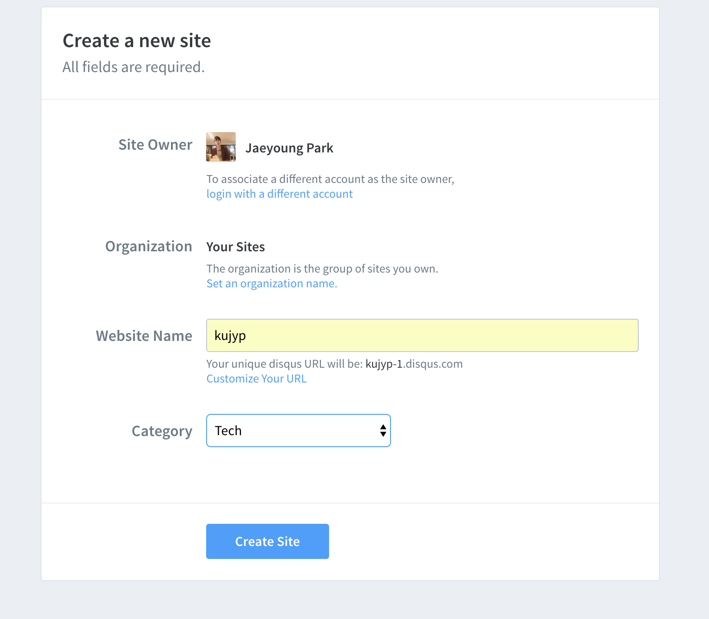
- basic plan 선택(무료)
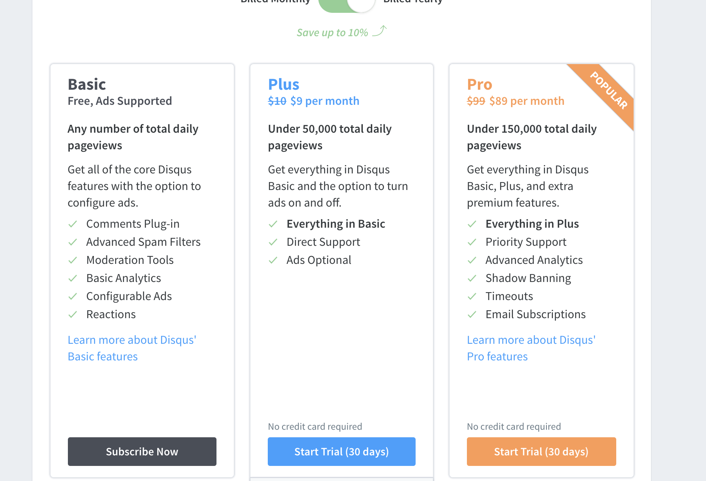
- 지킬 등 site generator 어느 것 사용했냐고 물어보는데, 맨 하단 `I dont's see my platform ~` 선택
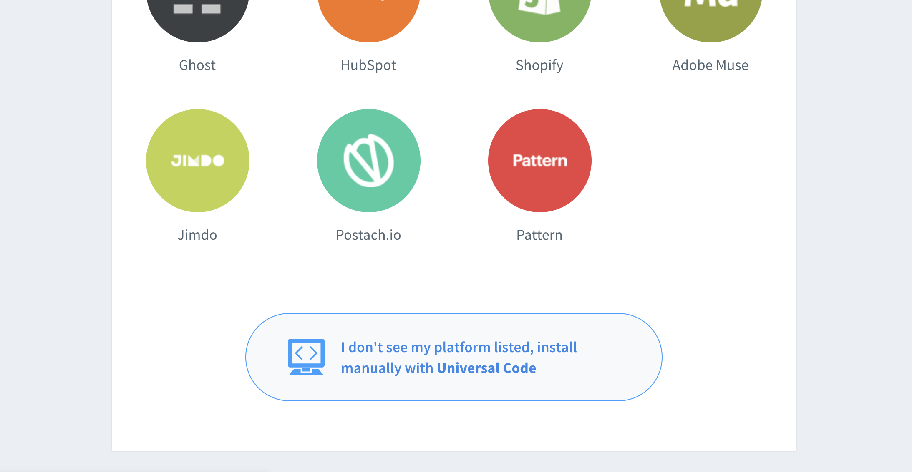
- website URL 입력, Complete Setup 클릭
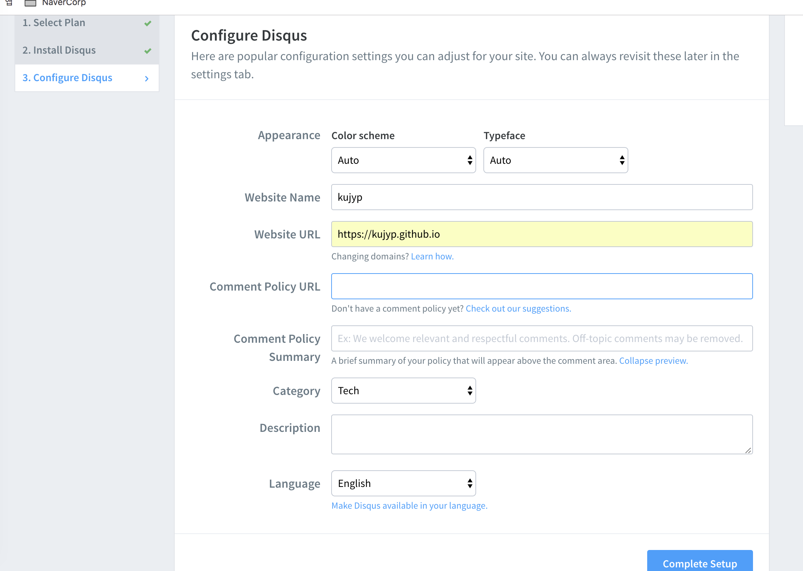
- 이제 사이트 추가는 완료되었다.<br/>
admin 페이지에서 settings - general 선택, shortname을 받아온다. <br/>
위의 프로젝트에서 gatsby-config.js disqusShortname 필드를 수정해준다. 
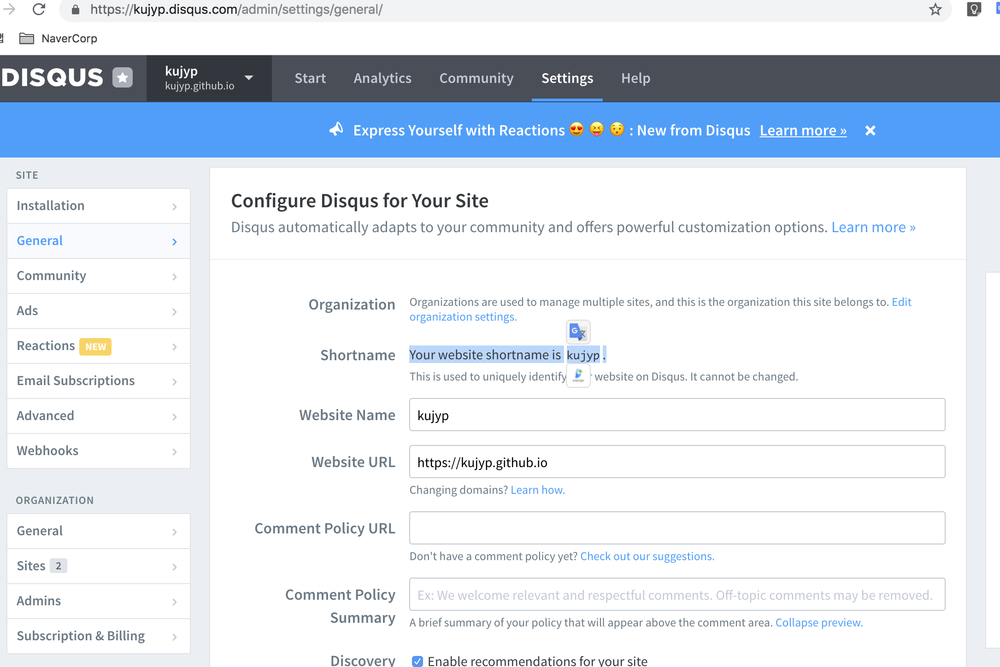
- 댓글기능 추가 완료
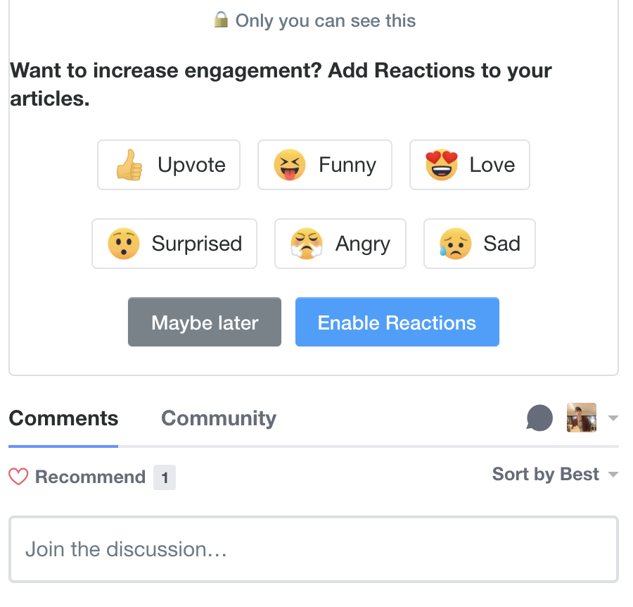


### 글 posting
이제 마지막으로 블로그 글을 포스팅하는 작업만 진행하면 된다.

- starter에 포함되어있는 형식대로 src/pages/articles 에 폴더를 하나 생성한다.
- 필요한 사진파일은 폴더내부에 같이 포함시켜준다.<br/>
(사용할때는 `` 으로 사용하면된다.
- markdown파일 맨 위에 frontmatter를 추가해준다.<br/>
starter에 있는 형식그대로 가져와서 title, date, layout 등등을 추가해주었다.
- 아래에 글내용을 markdown 형식으로 작성하면 완성.  
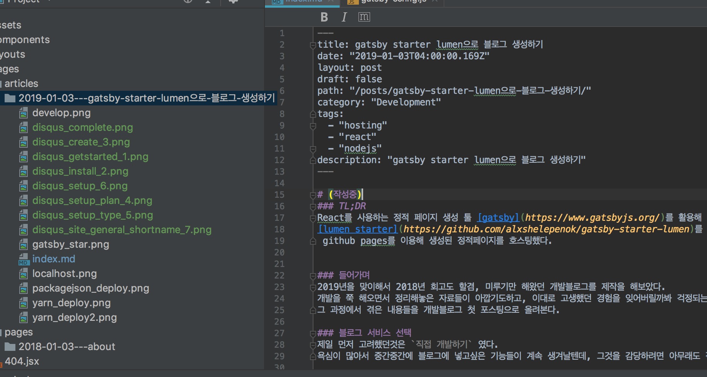
- 글 작성은 `yarn run develop` 커맨드를 통해 localhost:8000 에서 결과물을 확인하면서 진행하였다.
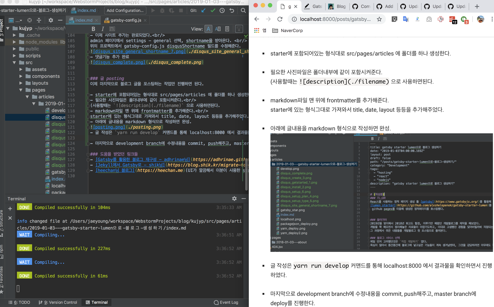
- 마지막으로 development branch에 수정내용을 commit, push해주고, master branch에 deploy를 진행한다.<br/>
`$ yarn run deploy`


### 마치며
gatsby를 활용하여, 인생 처음으로 기술블로그를 생성, 포스팅을 진행해보았다.<br/>
글쓰는게 생각보다... 쉽지않다.<br/>
1월 2일부터 쓰기시작해서 2일에 걸쳐 쓴것같은데, 다음글부터는 되도록 한호흡만에 글을 끝내도록 노력 해봐야겠다. 1편 2편으로 나눠야하나..

아 그리고 markdown 한줄만 띄우는방법을 몰라서`<br/>` 태그를 줄마다 붙이고있는데, 너무 불편하다.<br/>
github wiki에서도 이랬는데, github issue에서는 안그러고 완전 중구난방이다.(더 쉬운 방법 아시는분은 알려주세요...ㅜㅜ)

아무튼 이번글은 여기까지 마치고, 다음 글에서는 시간이 허락한다면 circleci를 활용해 deploy과정 자동화를 진행해봐야겠다.
 

### 도움을 받았던 링크들
- [Gatsby를 활용한 블로그 재구성 - adhrinae님](https://adhrinae.github.io/posts/creating-new-blog-with-gatsby)
- [Jekyll에서 Gatsby로 - shik님](https://blog.shik.kr/migrate-to-gatsby/)
- [heechan님 블로그](https://heechan.me)(UI가 깔끔해서 이분이 사용한 starter를 사용했다.)
