### TL;DR
Gatsby 정적블로그에 CircleCI를 활용해서 자동 Deploy 하는 Pipeline을 만들어보았다.

### CircleCI 연동
지난번에 블로그를 만들면서 생성한 Github Repository에 CircleCI 를 연동해서, deploy 작업을 자동화 시키려고한다. (지난글 - [gatsby starter lumen으로 블로그 생성하기](https://kujyp.github.io/posts/gatsby-starter-lumen%EC%9C%BC%EB%A1%9C-%EB%B8%94%EB%A1%9C%EA%B7%B8-%EC%83%9D%EC%84%B1%ED%95%98%EA%B8%B0/))<br/>
CircleCI는 Jenkins, Travis 처럼 CI 툴의 일종으로, Jenkins와 같은 설치형과 다르게 오픈소스에 대해<br/>
무료로 클라우드 자원을 할당해줘서, 본인의 서버가 필요없다는 장점이 있다.(Travis도 마찬가지 장점이 있다.)  

CircleCI를 연동하는 방법은 간단하다.
1. CircleCI에 Github계정으로 가입.
2. CircleCI에서 해당 Github Repository - "Set Up Project"
3. Github repository에 .circleci/config.yml 파일 추가
<br/>
<br/>

### 1. CircleCI에 Github 계정으로 가입.
https://circleci.com/ 접속 > 우측 상단 SignUp > Github으로 가입을 진행한다.
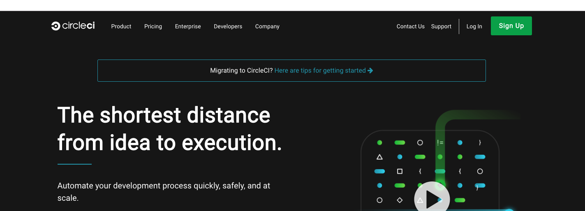<br/>

참고: 로그인 후 콘솔이 뜨지않는 경우 우측 상단의 Go to app 버튼을 클릭한다.
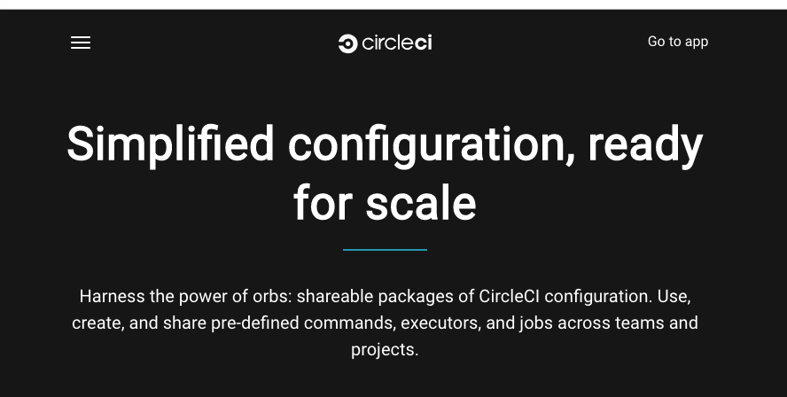<br/><br/>


### 2. CircleCI에서 해당 Github Repository - "Set Up Project"
위에서 뜬 콘솔창에서 좌측 Add Projects 버튼을 클릭 > 해당 Repository 우측의 "Set Up Project" 버튼을 클릭해준다.<br/>
참고: github.io 프로젝트는 이미 진행을 해놔서, 다른 프로젝트로 스크린샷을 찍어왔다.
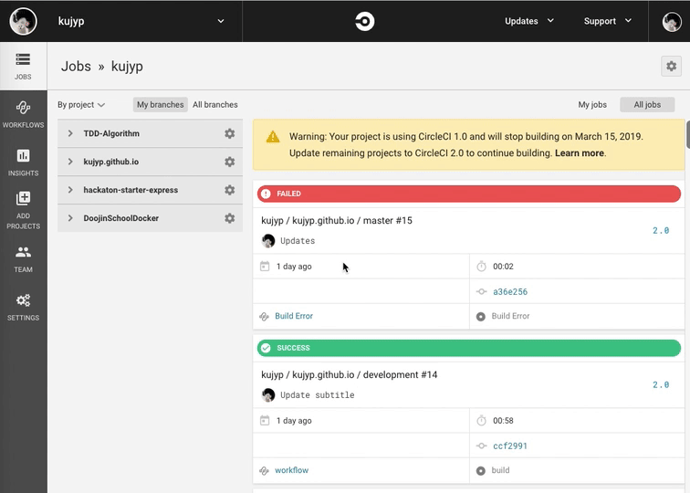

"Set Up Project" 버튼을 클릭하면 환경을 리스트가 나오는데, React Project이므로 Node를 선택해준다.<br/>
CircleCI를 부착하는 방법에 대해 설명이 나오는데, 맨아래에 보면 sample yaml 파일을 복사해갈수있다. 이를 복사하고 다음 단계로 진행한다.<br/>
드래그해서 복사해도되고, 2번단계에 잇는 "Copy To Clipboard" 버튼을 클릭해도된다.
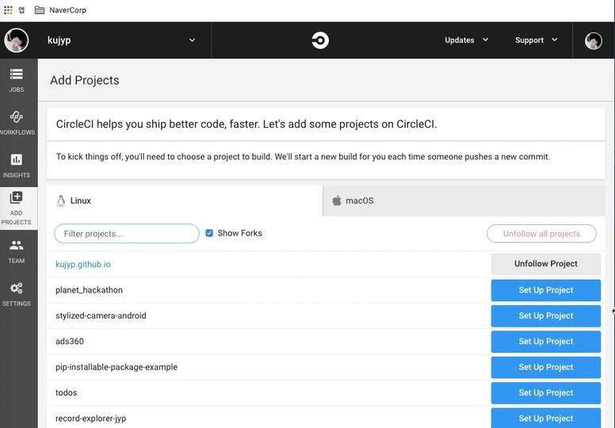<br/><br/>


### 3. Github repository에 .circleci/config.yml 파일 추가
방금 복사한 샘플 yml 내용을하고, Repository의 .circleci/config.yml 에 넣어준다.<br/>
나는 필요없는 부분은 제거하고, 마지막 run 부분을 `yarn run deploy` 로 변경해주었다.

https://github.com/kujyp/kujyp.github.io/commit/febd66ce8af272572d0108524899956d706e287b 
```yaml
version: 2.0

jobs:
  build:
    docker:
    - image: circleci/node:9.10.0

    working_directory: ~/app

    steps:
    - checkout

    - restore_cache:
        keys:
        - v1-dependencies-{{ checksum "package.json" }}
        - v1-dependencies-

    - run: yarn install

    - save_cache:
        paths:
        - node_modules
        key: v1-dependencies-{{ checksum "package.json" }}

    - run: yarn run deploy
```

해당 내용을 Repository에 push 한뒤, 위에서 진행하던 CircleCI 콘솔 5번째 단계인 Start Building 버튼을 눌러준다.<br/>
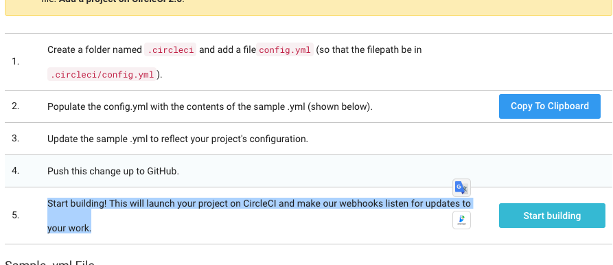<br/><br/>


### 4. Job failed
뭔가 쉽게쉽게 잘 풀리는듯 했으나, 모든 개발이 그러하듯 바로 에러가 나타난다.

#### 4-1. git empty name, email
CI를 부착하면 github commit 리스트에서 CI 결과 아이콘을 볼수 있는데,<br/>
작업 진행중에는 `노란 동그라미`가 나타나고, 실패하면 `빨간 엑스표시`, 성공하면 `초록 브이표시`가 나타난다.
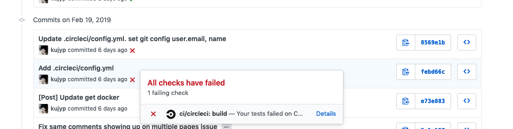

`엑스표시` 를 눌러서 나온 창에서 Details 링크를 클릭해보면 CircleCI 결과로그를 볼 수 있는데,<br/>
`Please tell me who you are.` 란다.<br/>
`gatsby build --prefix-paths && gh-pages -d public -b master` 를 진행하면서 git push를 진행하게되는데(build 결과를 `master branch`로 보낸다.)<br/>
push를 할 git 계정, 이메일이 설정되어있지 않다. 로컬이라면 미리 설정해둔 값으로 보냇겠지만 CI 작업이 진행되는 환경은 CircleCI 클라우드 서버에서 진행되므로 완전백지상태이다.<br/>
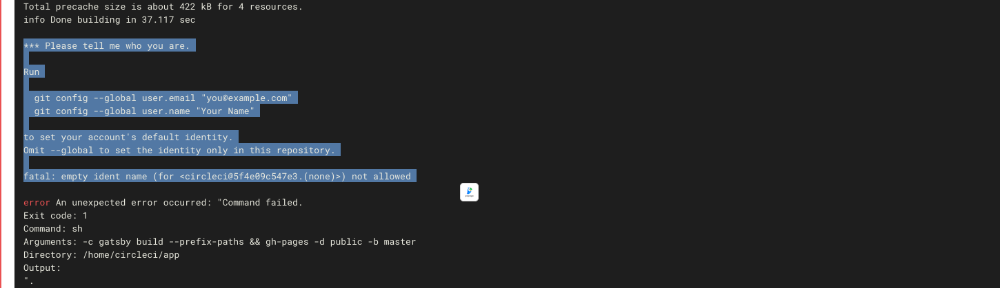

다시 `.circleci/config.yml`를 열어서 `yarn run deploy` 를 수행하기 전, `git config` 명령어를 수행해서 username, email을 설정해준다.  
https://github.com/kujyp/kujyp.github.io/commit/8569e1b2f76ebb7b655e0d23f7ae7513aab8c8ef
```yaml
# ...
    - run:
        command: |
          git config --global user.email "swe.jaeyoungpark@gmail.com"
          git config --global user.name "kujyp"
          yarn run deploy
```
<br/>

#### 4-2. github read only key
위의 에러를 해결하면 이번엔 다른 에러가 뜬다. The key you are authencating with has been marked **as read only.**
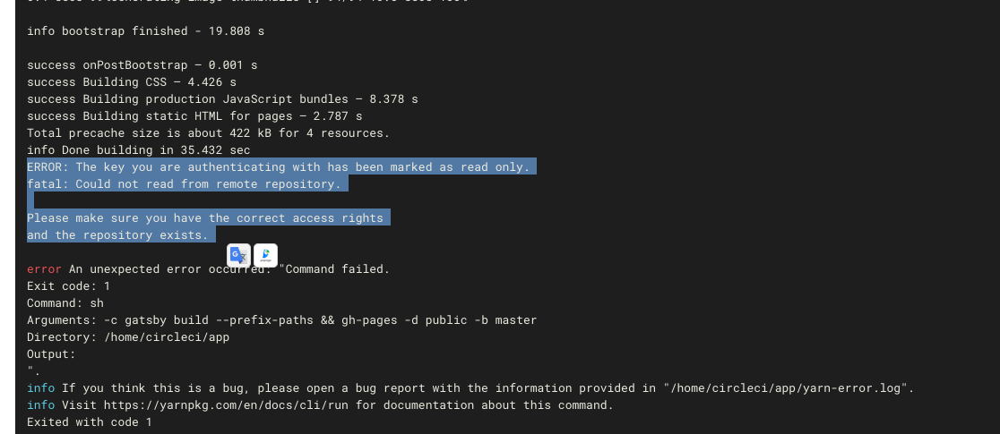<br/><br/>

CircleCI 는 Github에 접근할때 기본값으로 deploy key를 사용한다.<br/>
repository를 clone 해오는데는 문제가 없지만, read only 이기때문에 deploy 과정에서 수행하는 write 작업을 수행할 수 없다.

참고: deploy key. github 해당 repository settings 메뉴에서 볼 수 있다.
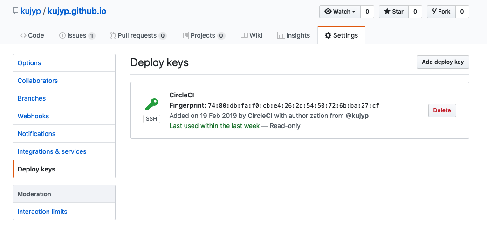<br/><br/>

Github write 권한을 주기위해 CircleCI 콘솔에 가서 ssh key를 추가해준다.<br/>
CircleCI Console > Jobs > 프로젝트명 우측 설정 버튼 클릭 > Checkout SSH keys 로 들어간다.<br/>
중간에 "Add user key" 부분이 있는데, `Authorize With Github`를 진행해준다. 
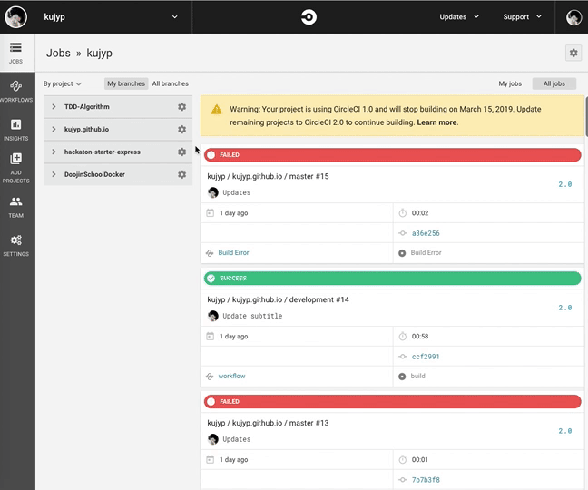<br/><br/>

이후 `Create and add user key`를 누르면 deploy key 외에 user key가 하나더 생성되고, Preferred가 설정되는것을 볼 수 있다.  
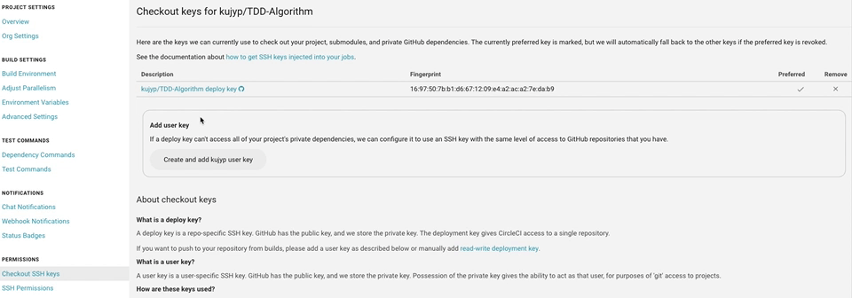<br/><br/>

Github에서도 user key(ssh key)가 추가된 것을 확인할 수 있다.<br/>
https://github.com/settings/keys 에 가보면 `CircleCI: kujyp/kujyp.github.io`가 자동생성 된 것을 볼수있다.
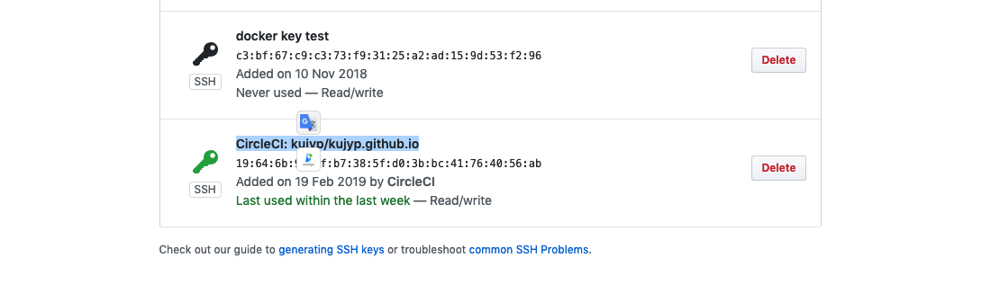<br/><br/>

#### 4-3. re-run job
read only key 문제를 해결하면, ssh key는 config.yml 파일 수정없이 적용된다.<br/>
하지만 CircleCI에 권한이 있는 user key를 추가한다고 해서 작업이 저절로 다시 수행되지는 않는다.

수동으로 re-run을 시켜하는데, Github에서 아까 실패한 마지막 commit 에 달려있는 링크를 타고 CircleCI 콘솔에 접속한다.<br/>
실패한 작업 옆에 Details link를 클릭하면된다.
<br/><br/>

접속한 CircleCI 콘솔에서 우측에 있는 rerun workflow를 클릭해주면, 추가해둔 user key를 이용해서 작업을 다시 수행하게된다.<br/>
참고: 이 짓이 귀찮으면 새 commit을 제출해도 새로 작업이 수행된다.
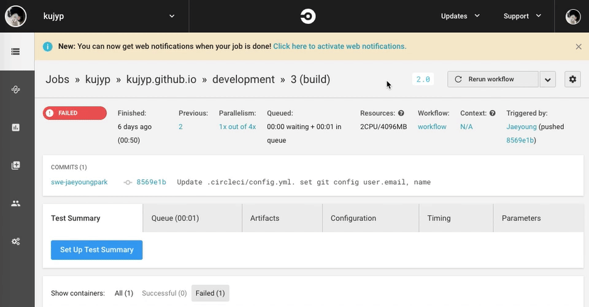<br/><br/>

추가로 수행한 작업은 결국 성공했다. 그런데 따로 작업이 기록되어서 github commit 옆에는 여전히 X 표시가 남아있다.
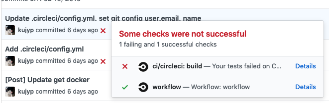<br/><br/>


### 5. Post 등록
자동 deploy 작업을 추가했으니, 글을 등록해서 작업이 잘 되는지 테스트해본다.<br/>
새로 글을 하나 작성하고 github development branch에 push 를 수행했다.

Github에 작업이 성공한것으로 아이콘이 변했다.
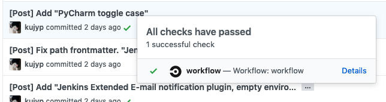<br/>
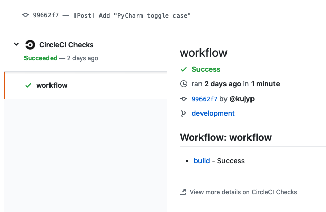<br/><br/>

실제 블로그에도 정상적으로 반영이 되는것을 확인 할 수 있었다.
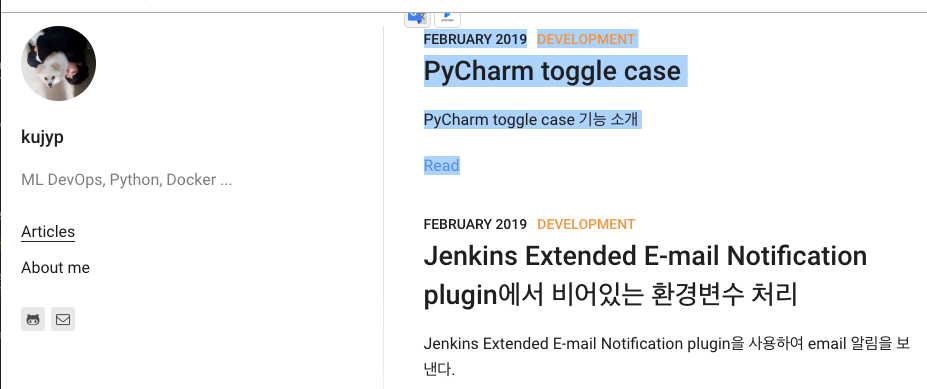

끝.
