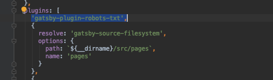
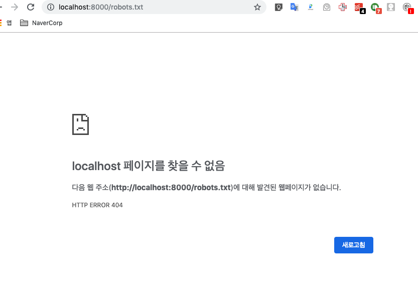
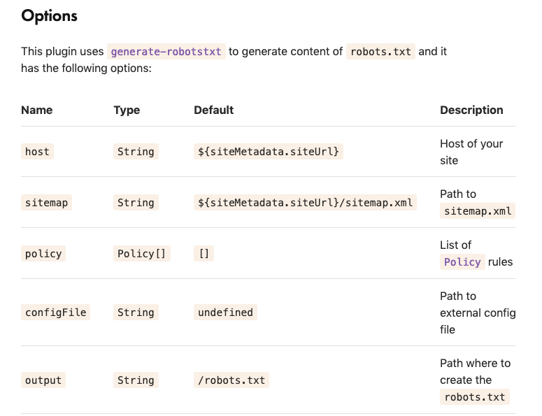
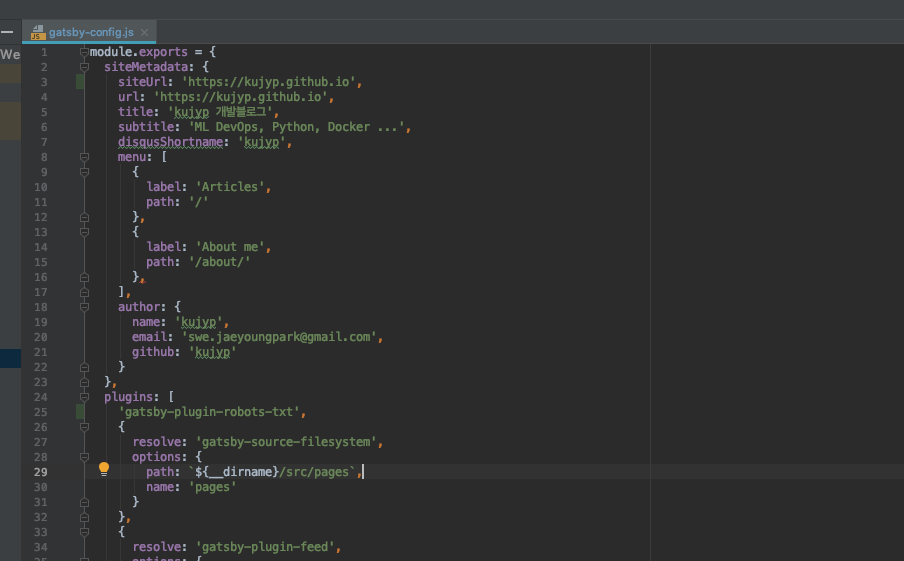
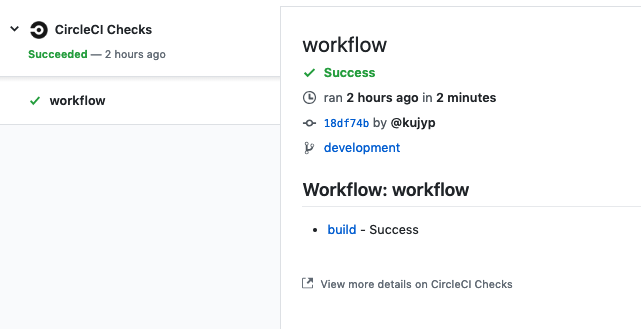
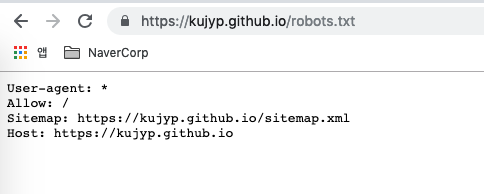

### TL;DR
gatsby-starter-lumen 으로 만든 블로그에 robots.txt를 추가했다. 


### robots.txt 추가
robots.txt 같은경우에는 gatsby plugin으로 잘 되어있어서 해당 플러그인을 설치하는것으로 진행하였다.<br/>
gatsby-plugin-robots-txt plugin - https://www.gatsbyjs.org/packages/gatsby-plugin-robots-txt<br/>

```bash
yarn add gatsby-plugin-robots-txt
# gatsby-config.js 수정
yarn run develop
```

project top level 에서 gatsby-config.js > plugins 에 `'gatsby-plugin-robots-txt'`를 추가해준다.
<br/><br/>

음... 역시나 삽질없이 적용되지는 않았다.<br/>
개발모드로 접속해보니 http://localhost:8000/robots.txt 주소에서 아무것도 돌려주지않는다.<br/>
<br/><br/>


이것저것 바꿔보아도 생기지않아서 당황했는데, <br/>
결론부터 이야기하면 `yarn run build` 를 수행하고 `yarn run develop`을 수행하면 잘 된다...<br/><br/>

[plugin 문서](https://www.gatsbyjs.org/packages/gatsby-plugin-robots-txt/#options)를 읽어보니 기본값으로 `siteMetadata.siteUrl` 을 참조했는데, <br/>
[gatsby-lumen-starter](https://github.com/alxshelepenok/gatsby-starter-lumen) 에는 해당 값이 미리 만들어져있지 않다. 새로 추가해줬다.<br/> 




수정사항을 github에 push를 하니, 이전글에서 세팅해놓은 자동배포 과정이 재대로 도는것을 확인할수 있었다.<br/>
이전글 - [gatsby 정적블로그 생성하기 - 자동deploy, CircleCI연동](/posts/2019-02-24---gatsby-정적블로그-생성하기---자동deploy,-CircleCI연동/)<br/>
<br/><br/>

정식사이트(https://kujyp.github.io/robots.txt)에도 잘 반영되었다.<br/>
<br/><br/>

끝.<br/>


### 참고
위에서 진행한 내용은 github 에서 commit내용으로 확인 가능하다.<br/>
https://github.com/kujyp/kujyp.github.io/commit/abe64c99dbf10de22c303c5f0d9984d7cae8245d
