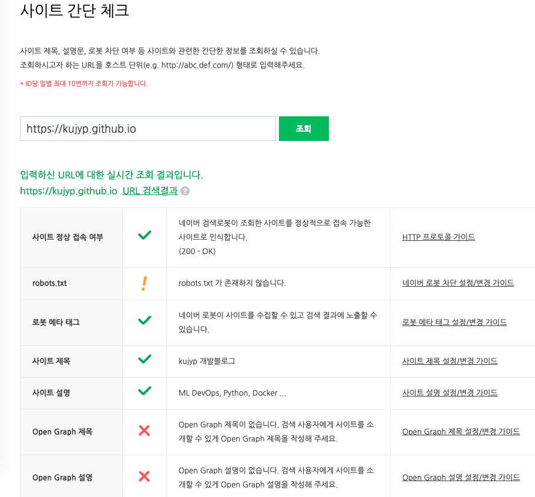
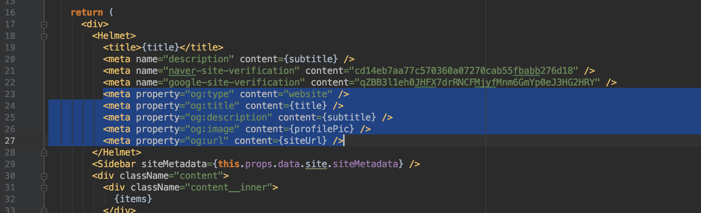
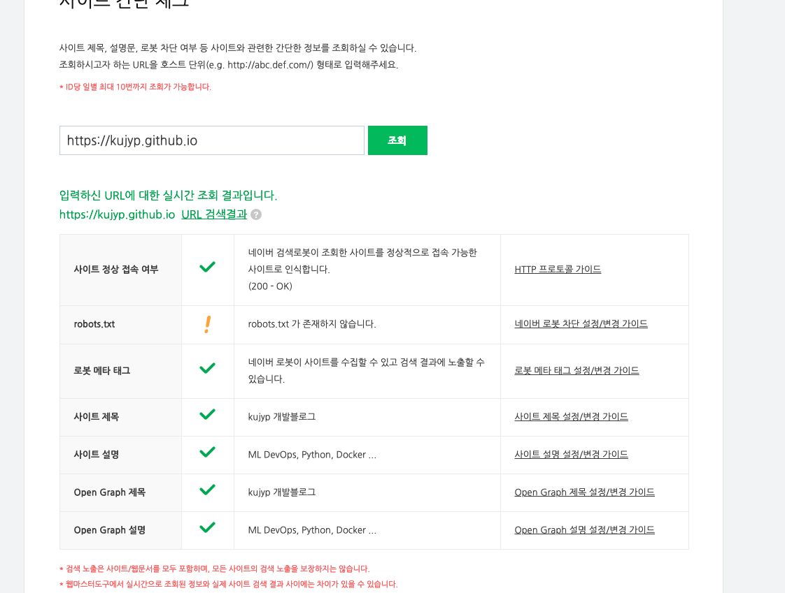
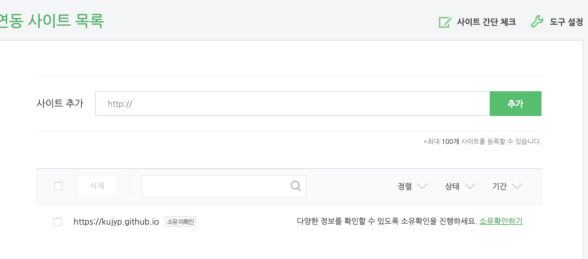
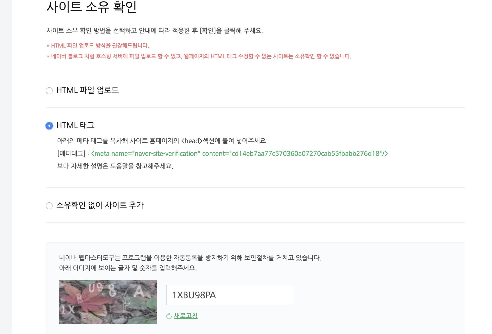
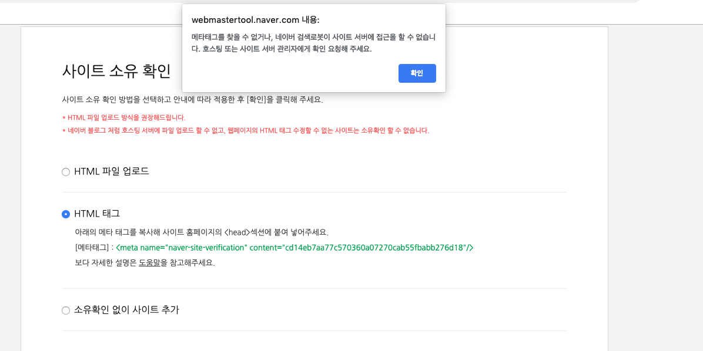
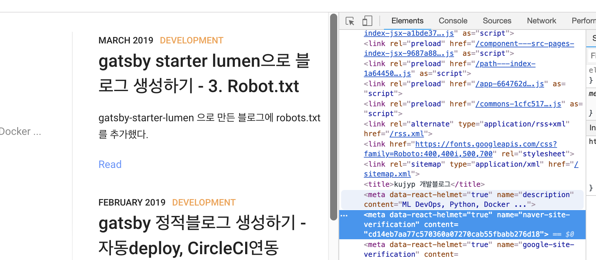

### TL;DR
네이버 검색엔진 Console에서 robots.txt추가, Open Graph meta tag 추가 등의 검색노출을 위한 작업을 진행했다.


### Naver webmaster tool
https://webmastertool.naver.com/guide/site_check.naver

먼저 네이버 웹 마스터 툴을 이용해서 사이트 간단체크를 진행하였다.<br/>
robots.txt, Open Graph tag가 미비한것으로 확인되었고, 추가를 진행했다.
<br/><br/>


### robots.txt 추가
[gatsby starter lumen으로 블로그 생성하기 - 3. Robot.txt](/posts/2019-03-12---gatsby-starter-lumen으로-블로그-생성하기---3-Robot.txt/)<br/><br/>


### Open Graph tag
`src/pages/index.jsx` 에서 <Helmet> 태그 내부에 Open Graph 요소를 <meta> tag로 넣었다. 
<br/><br/>

다시 위의 Naver webmaster console 에서 확인하니 Open graph 태그가 재대로 반영된것을 확인가능했다.<br/>
<br/><br/>


### Naver webmaster 사이트추가
https://webmastertool.naver.com/board/main.naver

위 링크에서 사이트 추가를 진행하였다.<br/>
<br/><br/>

`소유확인하기`를 눌러 인증을 진행했다. HTML 태그를 이용해 넣고, 위의 Open Graph 처럼 태그를 추가했다.<br/>
<br/><br/>

이유는 모르겠으나 메타태그를 찾을수 없다고 진행이 되지않았다..<br/>
<br/><br/>

site로 가서 태그가 재대로 적용이 되었는지 한번 더 확인을 해 보았다.<br/>
아래 내용으로 meta 태그가 붙어있는것을 확인가능했다.<br/>
설마 `data-react-helmet="true"` 때문인가.<br/>
아니겠지 설마 그정도로 단순하게 parsing code를 넣어놓진 않았겠지...
```html
<meta data-react-helmet="true" name="naver-site-verification" content="cd14eb7aa77c570360a07270cab55fbabb276d18">
```
<br/><br/>

일단 이 내용은 스킵하고 Google 쪽을 먼저 진행했다.<br/>
다음글에서 계속....<br/>


### 도움을 받았던 링크
- [구글 네이버 검색노출(SEO) 즉시반영하기 - intiwatana](https://intiwatana.github.io/FrontEnd/SEO/%EA%B5%AC%EA%B8%80-%EB%84%A4%EC%9D%B4%EB%B2%84-%EA%B2%80%EC%83%89%EB%85%B8%EC%B6%9C-%EC%A6%89%EC%8B%9C%EB%B0%98%EC%98%81/)
